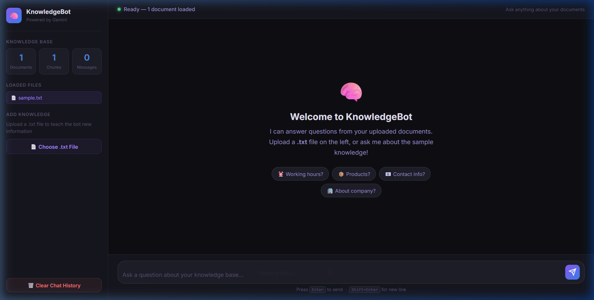
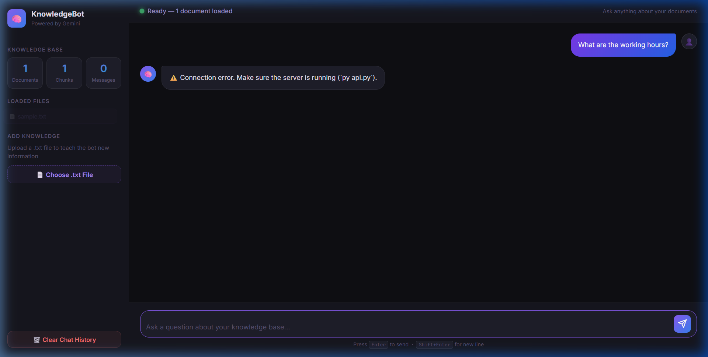

<div align="center">

# 🧠 KnowledgeBot

### AI-Powered Knowledge Base Chatbot

[](https://python.org)
[](https://aistudio.google.com)
[](https://fastapi.tiangolo.com)
[](https://trychroma.com)
[](LICENSE)

**Ask questions. Get intelligent answers. From your own documents.**

[🚀 Quick Start](#-quick-start) • [💡 How It Works](#-how-it-works) • [📸 Screenshots](#-screenshots) • [🛠️ Tech Stack](#️-tech-stack)

</div>

---

## 📸 Screenshots

<table>
  <tr>
    <td></td>
    <td></td>
  </tr>
  <tr>
    <td align="center"><b>Welcome Screen</b></td>
    <td align="center"><b>Chat in Action</b></td>
  </tr>
</table>

---

## ✨ Features

| Feature | Description |
|---------|-------------|
| 🤖 **AI-Powered Answers** | Uses Google Gemini to understand and answer questions naturally |
| 🔍 **Semantic Search** | Finds relevant info even if wording is different from the document |
| 🗄️ **Local Vector DB** | ChromaDB stores all embeddings locally — your data stays private |
| 💬 **Chat Memory** | Remembers previous questions in the same session |
| 📄 **File Upload** | Upload `.txt` files directly from the browser |
| 🔄 **Instant Learning** | Add new documents and the bot learns immediately |
| 🌐 **Web Interface** | Beautiful ChatGPT-style browser UI |
| 💻 **Terminal Mode** | Simple command-line interface also available |

---

## 🚀 Quick Start

### 1. Clone the repository
```bash
git clone https://github.com/Numesh20/knowledge-base-bot.git
cd knowledge-base-bot
```

### 2. Install dependencies
```bash
pip install -r requirements.txt
```

### 3. Get a FREE Gemini API Key
1. Go to 👉 [aistudio.google.com](https://aistudio.google.com)
2. Sign in with Google → **Get API Key** → **Create API Key**
3. Copy your key

### 4. Set up your API key
Create a `.env` file in the project root:
```bash
GEMINI_API_KEY=your-key-here
```
> 💡 Use `.env.example` as a template — never commit your real `.env` to Git!

### 5. Add your knowledge
Place `.txt` files inside the `knowledge/` folder.
A sample file (`knowledge/sample.txt`) is already included to test with.

### 6. Run the bot

**Option A — Web UI (Recommended)**
```bash
py api.py
```
Then open 👉 **http://localhost:8000** in your browser

**Option B — Terminal**
```bash
py bot.py
```

---

## 💡 How It Works

KnowledgeBot uses **RAG (Retrieval-Augmented Generation)** — the same pattern used by ChatGPT plugins and enterprise AI systems.

```
Your Documents (.txt files)
         ↓
  [Split into chunks]
         ↓
  [Convert to vectors]  ← Gemini Embedding API
         ↓
  [Store in ChromaDB]   ← Local vector database
         ↓
━━━━━━━━━━━━━━━━━━━━━
User asks a question
         ↓
  [Find similar chunks] ← Semantic search
         ↓
  [Send to Gemini AI]   ← Context + Question
         ↓
  [Get smart answer]    ← Grounded in your data
```

### Why RAG?
- ✅ **No hallucinations** — answers are grounded in YOUR documents
- ✅ **Always up-to-date** — add new files anytime
- ✅ **Cites sources** — shows which file the answer came from
- ✅ **Cost-effective** — no need to retrain expensive AI models

---

## 📁 Project Structure

```
knowledge-base-bot/
├── 🤖 bot.py              # Terminal chatbot
├── 🌐 api.py              # FastAPI web server
├── 📋 requirements.txt    # Python dependencies
├── 🔒 .gitignore          # Protects secrets
├── 📄 README.md           # This file
│
├── static/                # Web UI files
│   ├── index.html         # Chat interface
│   ├── style.css          # Dark theme styles
│   └── chat.js            # Chat logic
│
└── knowledge/             # Your documents go here!
    └── sample.txt         # Example knowledge base
```

---

## 🛠️ Tech Stack

| Layer | Technology | Purpose |
|-------|-----------|---------|
| **Language** | Python 3.14 | Core programming language |
| **AI Model** | Google Gemini 3.6 Flash | Answer generation (free tier) |
| **Embeddings** | Gemini Embedding 001 | Convert text to vectors |
| **Vector DB** | ChromaDB | Store & search embeddings locally |
| **Web Server** | FastAPI + Uvicorn | REST API backend |
| **Frontend** | HTML + CSS + JavaScript | Browser chat interface |
| **Config** | python-dotenv | Secure API key loading |

---

## 📚 API Endpoints

| Endpoint | Method | Description |
|----------|--------|-------------|
| `/` | GET | Serve the chat web UI |
| `/chat` | POST | Send a message, get an answer |
| `/upload` | POST | Upload a `.txt` knowledge file |
| `/stats` | GET | Get knowledge base statistics |
| `/clear` | POST | Clear chat history |

---

## 🔒 Security

- ✅ **API keys** are stored in `.env` — never committed to Git
- ✅ **`.gitignore`** excludes `.env` and `chroma_db/`
- ✅ **Local database** — your documents never leave your machine
- ✅ **GitHub secret scanning** protection enabled

---

## 🗺️ Roadmap

- [x] Terminal chatbot
- [x] Web UI with file upload
- [x] Chat memory (session history)
- [ ] PDF support
- [ ] Auto-learning scheduler
- [ ] Online deployment
- [ ] User feedback (thumbs up/down)
- [ ] Multi-language support

---

## 📖 Learning Resources

- [What is RAG?](https://cloud.google.com/use-cases/retrieval-augmented-generation)
- [Google Gemini API Docs](https://ai.google.dev/docs)
- [ChromaDB Documentation](https://docs.trychroma.com)
- [FastAPI Tutorial](https://fastapi.tiangolo.com/tutorial/)

---

<div align="center">

Built with ❤️ for learning AI development.

⭐ **Star this repo if it helped you learn!** ⭐

</div>
